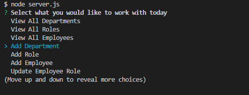

# employee-management-system

# Description
This is a content management system that tracks and is able to update departments, roles, and employees of a company.  This can all be done from the command line.  It's an easy to use tool perfect for any manager looking to stay more organized.

Building an app from scratch is always a challenge.  Making sure the SQL syntax was correct was one of the hardest parts of this assignment.  I did enjoy seeing everything interact with each other.

# Contributors
I wrote the code, but received help from multiple BCS Tutors, my classmate Sam, TA Michael, and instructor John.

# Usage
To use this app, you will need to have Node, MySQL, and content.table installed.

# Testing
To start, run MySql and run the db/schema.sql file.  Then you will run "node server.js" from the command line.  Then select and answer the prompts as necessary.  See the video below for a demonstration.  Below that, I have attached a screenshot for what the prompts should look like when the app is called correctly.

# License
Matt Carlson Code 2022